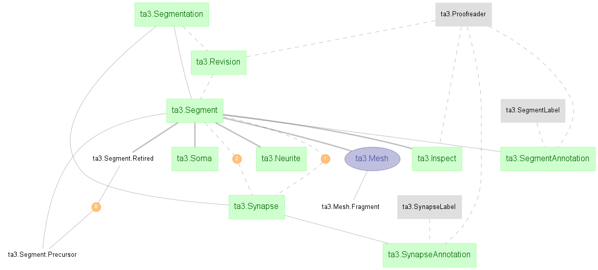
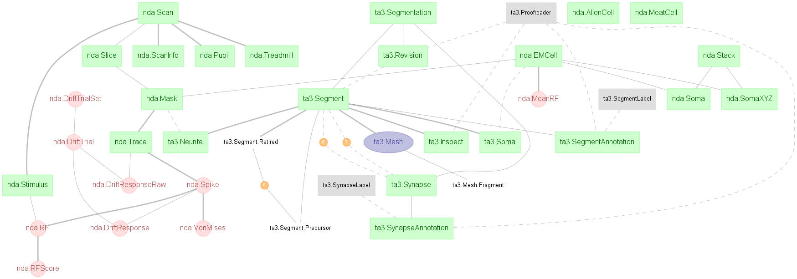

# MICrONS TA3

Please review [[Intro.ipynb]] http://nbviewer.jupyter.org/github/cajal/microns-ta3/blob/master/Intro.ipynb

## Schema TA3
The `ta3` schema contains results of segmentation and editing of seghments:

The schema works together with schema `nda` containing the matching functional data.

